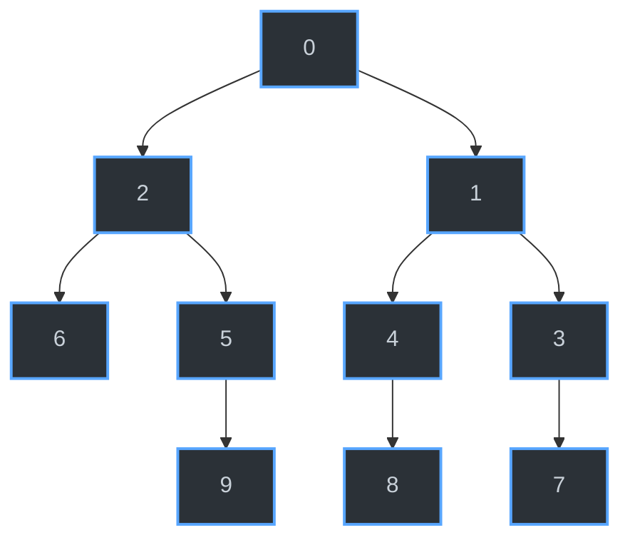

 Abaixo está a representação visual da lista de adjacência implementada no código, gerada dinamicamente utilizando **Mermaid**:

A estrutura acima corresponde à seguinte lista de adjacência:
* **Vértice 0:** aponta para 2 e 1
* **Vértice 1:** aponta para 4 e 3
* **Vértice 2:** aponta para 6 e 5
* **Vértice 3:** aponta para 7
* **Vértice 4:** aponta para 8
* **Vértice 5:** aponta para 9
* **Vértices 6, 7, 8, 9:** não possuem arestas de saída (nós folha)
