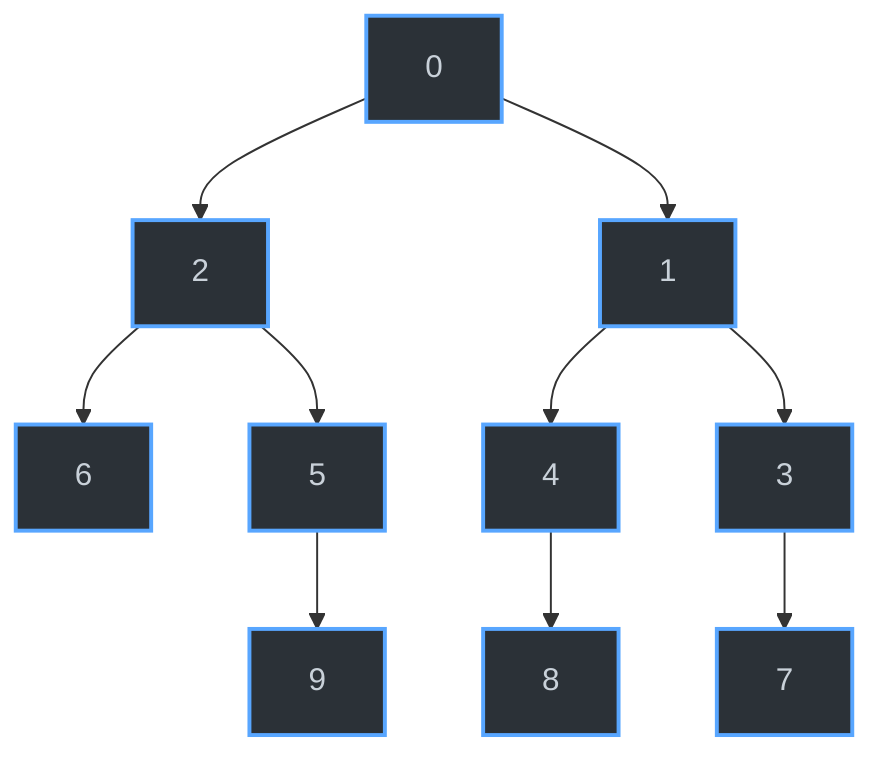

# 🕸️ Repositório de Estudos: Grafos e Algoritmos de Busca

Bem-vindo ao repositório de estudos sobre **Grafos**! Este projeto foi criado com o objetivo de implementar, testar e visualizar estruturas de dados não lineares, com foco em listas de adjacência e algoritmos clássicos de travessia (Busca em Profundidade e Busca em Largura).

## 🚀 Sobre o Projeto

O estudo de grafos é fundamental na ciência da computação para modelar redes, rotas, dependências e muito mais. Aqui, implementamos a estrutura base de um grafo direcionado/não direcionado utilizando listas de adjacência e validamos seu comportamento através de algoritmos de busca.

### Algoritmos Implementados:
- **DFS (Depth-First Search)**: Busca em Profundidade. Explora o máximo possível cada ramo antes de retroceder.
- **BFS (Breadth-First Search)**: Busca em Largura. Explora os vértices vizinhos nível por nível.

---

## 📊 Visualização do Grafo de Teste

Para validar os algoritmos, criamos um grafo de teste específico. Abaixo está a representação visual da lista de adjacência implementada no código, gerada dinamicamente utilizando a sintaxe **Mermaid**:



A estrutura acima corresponde à seguinte lista de adjacência:
* **Vértice 0:** aponta para 2 e 1
* **Vértice 1:** aponta para 4 e 3
* **Vértice 2:** aponta para 6 e 5
* **Vértice 3:** aponta para 7
* **Vértice 4:** aponta para 8
* **Vértice 5:** aponta para 9
* **Vértices 6, 7, 8, 9:** não possuem arestas de saída (nós folha)

---

## 🧪 Resultados das Buscas

Ao executar os algoritmos de travessia partindo do **Vértice 0**, obtivemos os seguintes caminhos:

### 🔻 Busca em Profundidade (DFS)
A ordem de visitação dos nós explorando a fundo os caminhos da esquerda (priorizando o vértice 2, depois o 6, etc.) resulta em:
> `0 -> 2 -> 6 -> 5 -> 9 -> 1 -> 4 -> 8 -> 3 -> 7`

### 🌊 Busca em Largura (BFS)
A ordem de visitação dos nós explorando por níveis (primeiro os vizinhos diretos do 0, depois os vizinhos dos vizinhos) resulta em:
> `0 -> 2 -> 1 -> 6 -> 5 -> 4 -> 3 -> 9 -> 8 -> 7`

---

## 🛠️ Como executar (Exemplo)

Caso deseje compilar e rodar o código fonte deste repositório na sua máquina, siga os passos abaixo:

1. Clone este repositório:
   ```bash
   git clone https://github.com/seu-usuario/estudo-grafos.git
   ```
2. Navegue até a pasta do projeto:
   ```bash
   cd estudo-grafos
   ```
3. Compile e execute o arquivo principal (ajuste o comando conforme a linguagem utilizada, ex: Python, C++, Java):
   ```bash
   python main.py
   ```

---
*Repositório mantido para fins de estudo e documentação de aprendizado em Estruturas de Dados.*