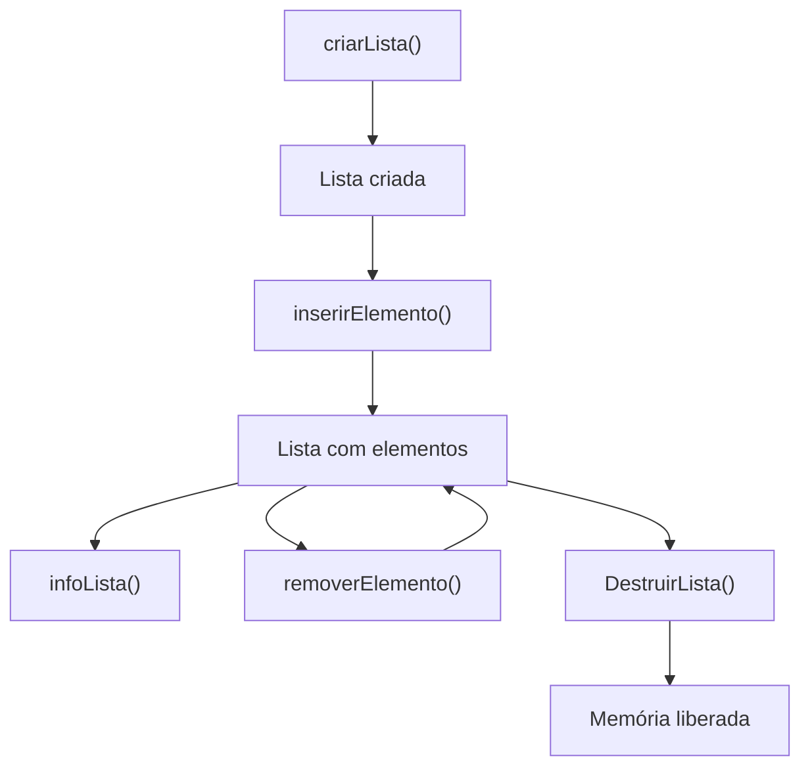

# 📋 Lista Dinâmica em C

Implementação de uma **lista simplesmente encadeada dinâmica** em linguagem C.

O projeto utiliza alocação dinâmica de memória para permitir a criação, inserção, remoção, visualização e destruição dos elementos da lista.

---

## 📌 Funcionalidades

* ✅ Criar uma lista
* ➕ Inserir elementos no final da lista
* ❌ Remover elementos pelo valor
* 🔎 Exibir os elementos da lista
* 🔢 Contar a quantidade de elementos
* 🗑️ Liberar toda a memória utilizada pela lista

---

## 🧩 Estrutura da Lista

Cada elemento da lista possui duas informações:

* `valor` → valor inteiro armazenado
* `proximo` → ponteiro para o próximo elemento

A estrutura funciona da seguinte maneira:

```text
┌─────────────┬──────────────┐
│    valor    │   proximo ──────────┐
└─────────────┴──────────────┘      │
                                    ▼
                              ┌─────────────┬──────────────┐
                              │    valor    │   proximo ──────────┐
                              └─────────────┴──────────────┘      │
                                                                 ▼
                                                           ┌─────────────┬──────────────┐
                                                           │    valor    │    NULL      │
                                                           └─────────────┴──────────────┘
```

Ou, de forma simplificada:

```text
Lista
  │
  ▼
[10 | •] ───► [20 | •] ───► [30 | NULL]
```

---

## 🔄 Fluxo das Operações



---

## ⚙️ Funções

### `criarLista()`

```c
Lista* criarLista();
```

Cria um novo elemento utilizando alocação dinâmica de memória.

O elemento é inicializado com:

```text
valor   = 0
proximo = NULL
```

### Retorno

| Situação              | Retorno                    |
| --------------------- | -------------------------- |
| Alocação bem-sucedida | Ponteiro para a nova lista |
| Falha na alocação     | `NULL`                     |

---

### `inserirElemento()`

```c
Lista* inserirElemento(Lista* lista, int valor);
```

Insere um novo elemento **no final da lista**.

#### Exemplo

Lista inicial:

```text
[10] → [20] → [30] → NULL
```

Executando:

```c
lista = inserirElemento(lista, 40);
```

Resultado:

```text
[10] → [20] → [30] → [40] → NULL
```

Caso a lista esteja vazia, o novo elemento se torna o primeiro elemento.

---

### `removerElemento()`

```c
Lista* removerElemento(Lista* lista, int valor);
```

Procura o primeiro elemento que possui o valor informado e o remove da lista.

#### Removendo o primeiro elemento

```text
Antes:

[10] → [20] → [30] → NULL

removerElemento(lista, 10)

Depois:

[20] → [30] → NULL
```

#### Removendo um elemento do meio

```text
Antes:

[10] → [20] → [30] → NULL

removerElemento(lista, 20)

Depois:

[10] → [30] → NULL
```

Se o valor não for encontrado, a lista permanece inalterada.

---

### `infoLista()`

```c
void infoLista(Lista* lista);
```

Percorre a lista e exibe todos os seus elementos, além da quantidade total de elementos.

#### Exemplo

```text
10 -> 20 -> 30 -> NUL
```
